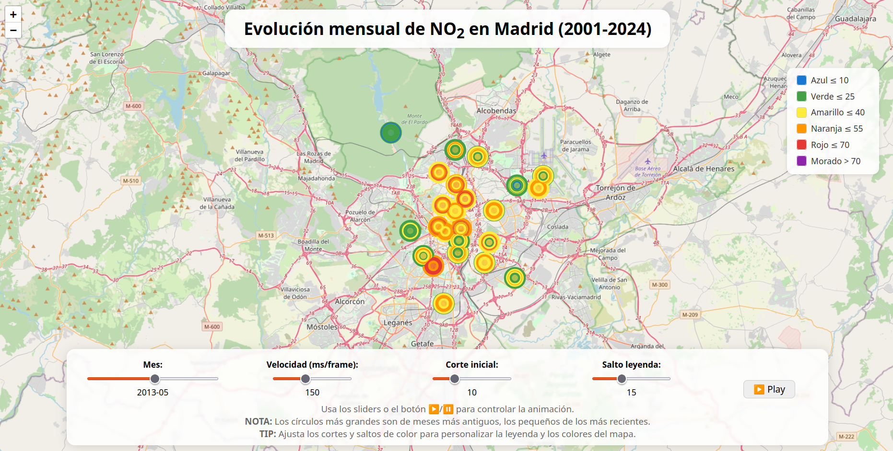

# Mapa de la evolución de la contaminación del aire de Madrid de 2001 a 2024

Del 12 al 14 de septiembre de 2014, se desarrolló un **hackathon global contra el cambio climático** en donde participé y en donde a mi se me ocurrió hacer un [mapa con la evolución de la contaminación del aire de Madrid 2014](https://github.com/asanzdiego/mapa-evolucion-contaminacion-aire-madrid).

Ahora, 10 años después lo actualizo. En vez de hacerlo con **Bash Shell Script** y **CartoDB** ahora lo he hecho con **[un cuaderno de Jupyter de Python](https://github.com/asanzdiego/mapa-evolucion-contaminacion-aire-madrid-2024/blob/master/mapa-evolucion-contaminacion-aire-madrid-2024.ipynb)** y con **leaflet** en HTML, CSS y JS.

## ¿Cómo lo he hecho?

### Búsqueda de datos

Lo primero fue buscar un **conjunto de datos sobre la contaminación del aire en Madrid**.

Lo encontré en la [página web de datos abiertos del Ayuntamiento de Madrid](http://datos.madrid.es/), exactamente en el apartado sobre [calidad del aire con datos desde 2001](http://datos.madrid.es/portal/site/egob/menuitem.c05c1f754a33a9fbe4b2e4b284f1a5a0/?vgnextoid=aecb88a7e2b73410VgnVCM2000000c205a0aRCRD&vgnextchannel=374512b9ace9f310VgnVCM100000171f5a0aRCRD).

### Descarga de datos

Desde el último enlace descargué todos los datos que están en la [carpeta datos/descargados](https://github.com/asanzdiego/mapa-evolucion-contaminacion-aire-madrid-2024/tree/master/datos/descargados).

### Geo-coordenadas de las estaciones

En los datos del Ayuntamiento de Madrid están **los códigos de las estaciones atmosféricas, pero solo las geo-coordenadas de las actuales, no de todas**.

Gracias a Félix Pedrera ([@fpedrera](https://twitter.com/fpedrera)) encontré las Geo-Coordenadas de las estaciones atmosféricas en [AirBase - The European air quality database](http://www.eea.europa.eu/data-and-maps/data/airbase-the-european-air-quality-database-8), exactamente me descargué el fichero [estaciones/AirBase_v8_stations.csv](https://github.com/asanzdiego/mapa-evolucion-contaminacion-aire-madrid/raw/master/estaciones/AirBase_v8_stations.csv).

Una vez filtrados y parseadas los datos nos queda este bonito [fichero CSV con las geo-posiciones de las estaciones atmosféricas de Madrid](https://github.com/asanzdiego/mapa-evolucion-contaminacion-aire-madrid-2024/blob/master/datos/estaciones-madrid.csv).
Con los datos en bruto, tenía que **filtrar y parsear los datos de las estaciones atmosféricas**.

### Procesamiento de datos

Una vez descargados los datos, interpretando los [metadatos](https://github.com/asanzdiego/mapa-evolucion-contaminacion-aire-madrid-2024/blob/master/datos/Interprete_ficheros_calidad_del_aire_global.pdf), filtramos por el Dioxido de Nitrógeno, hacemos la media por meses, y volcamos todo a un bonito [fichero JS con los datos que nos hacen falta](https://github.com/asanzdiego/mapa-evolucion-contaminacion-aire-madrid-2024/blob/master/mapa-evolucion-contaminacion-aire-madrid-2024.js).

También [volcamos esos datos en CSV](https://github.com/asanzdiego/mapa-evolucion-contaminacion-aire-madrid-2024/blob/master/datos/mapa-evolucion-contaminacion-aire-madrid-2024.csv) por si a alguien le interesa.

### Visualización de datos

Finalmente creo un fichero HTML, con su CSS y su JS para poder visualizar la [evolución de la contaminación del aire de Dioxido de Nitrógeno de Madrid de 2001 hasta 2024](https://asanzdiego.github.io/mapa-evolucion-contaminacion-aire-madrid-2024/mapa-evolucion-contaminacion-aire-madrid-2024.html).
